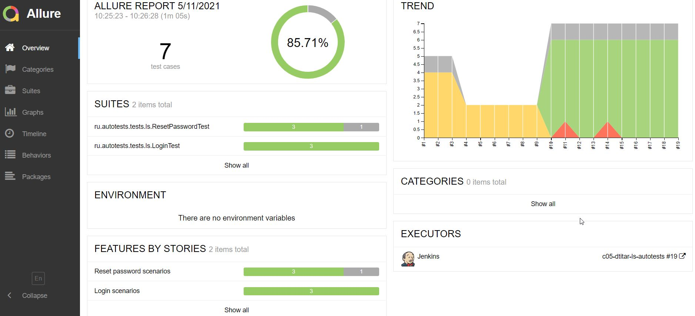
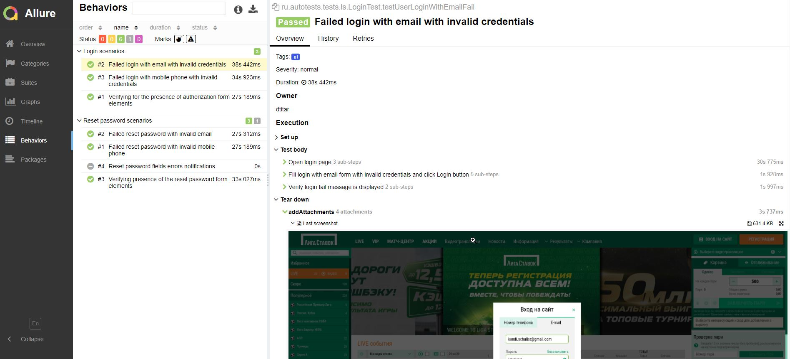
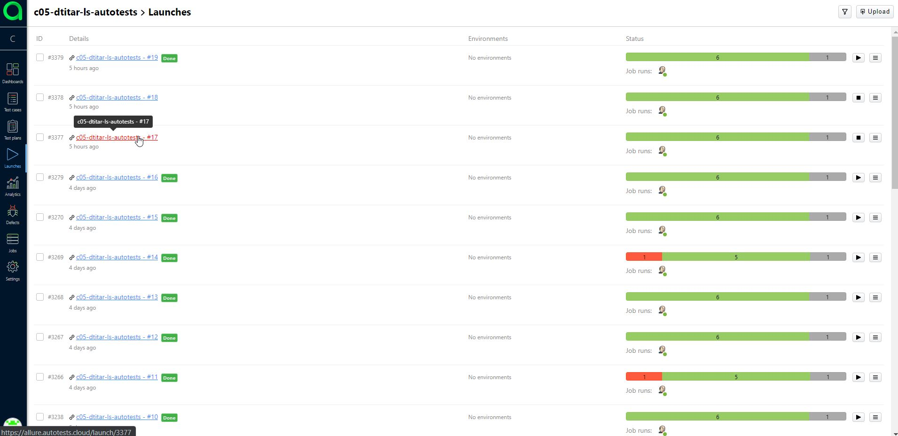
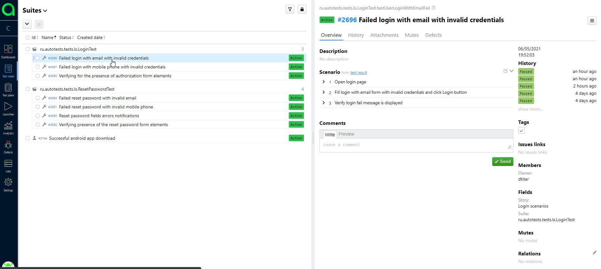
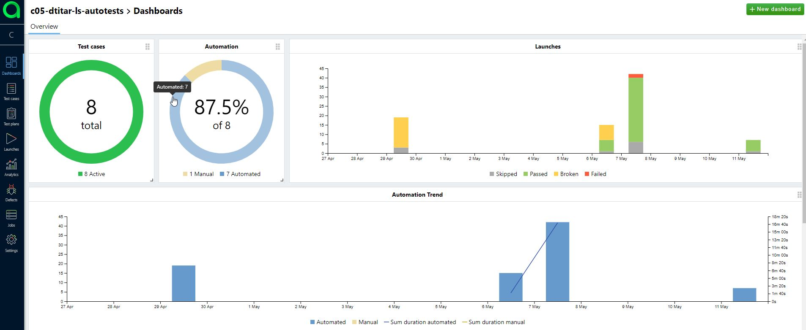

# Демо-проект автоматизации тестирования
*наименование*

# Используемые технологии

- Java
- Gradle
- Junit5
- Selenide
- RestAssured
- Allure Report
- Jenkins
- Selenoid
- Telegram Bot

# Описание
Примеры автоматизированных тестовых сценариев для тестирования *описание тестируюемого функционала*

- Тесты запущены из Jenkins
- Для запуска браузеров в docker-контейнеров использован Selenoid
- Сгенерирован отчет Allure report (автоматически добавлены скриншоты и видео прохождения тестов)
- Отчет загружен в TMS - Allure TestOps
- На основании Allure-отчета в Allure TestOps автоматически созданы тест-кейсы 
- Для примера в Allure TestOps добавлен ручной тест
- Уведомление с отчетом о прохождении тестов отправлено в Telegram

## Отчеты Allure reports
### Общий отчет о прохождении тест-сьюта

### Детальный отчет о прохождении конкретного теста

### Видео прохождения теста

## Отчеты Allure TestOps
### Запуски

- **id #2935** - Прохождение ручного тест-кейса
- **id #2933** - Прохождение автоматизированных тест-кейсов

### Тест-кейсы

- **id #2449** - Ручной тест-кейс

### Allure TestOps Dashboard

## Уведомление в Telegram

## Ссылки
### Jenkins

### Allure reports

